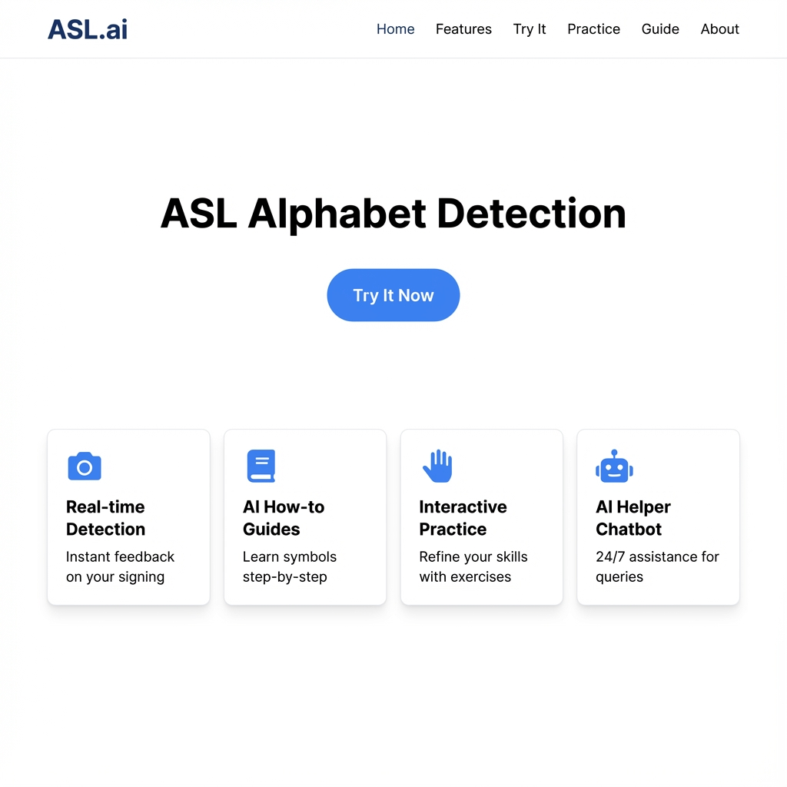

# ASL Real-time Recognition Project

This project integrates **two machine learning models** — a MobileNet deep learning model and a Random Forest classifier — with a web frontend to provide real-time American Sign Language (ASL) letter recognition using webcam input.

## Screenshot



## Project Structure

```
asl_project_2models/
├── app.py                              # Flask backend application
├── model/
│   ├── asl_model.keras                 # MobileNet TensorFlow/Keras model
│   └── asl_landmark_rf_model_enhanced.pkl  # Random Forest model with label encoder
├── templates/
│   ├── index.html                      # Frontend HTML with integrated JavaScript
│   └── index_fixed.html                # Alternative frontend version
└── requirements.txt                    # Python dependencies
```

## Features

- **Real-time ASL Detection**: Uses webcam input to recognize ASL letters A-Z
- **Dual Model Support**: Choose between MobileNet (deep learning) or Random Forest (traditional ML)
- **Interactive Frontend**: Clean, responsive web interface with practice modes
- **Flask Backend**: Serves the website and processes image predictions
- **MediaPipe Integration**: Hand landmark detection for both models

## Models

### 1. MobileNet Model (Deep Learning)
- **Input**: Hand skeleton ROI images (224x224x3)
- **Architecture**: MobileNet-based CNN trained on hand skeleton visualizations
- **Processing**: Uses MediaPipe to detect hand landmarks, draws skeleton, crops ROI, and feeds to model
- **Output**: 26 ASL letters (A-Z)

### 2. Random Forest Model (Traditional ML)
- **Input**: 75 engineered features from hand landmarks
  - 63 raw landmark coordinates (21 landmarks × 3 dimensions)
  - 12 computed distances between key finger points
- **Architecture**: Random Forest classifier with enhanced feature engineering
- **Processing**: Extracts hand landmarks via MediaPipe and computes geometric features
- **Output**: 26 ASL letters (A-Z) with label encoding

## Installation & Setup

### Prerequisites
- Python 3.7+
- Webcam access
- Modern web browser

### Installation Steps

1. **Clone or download the project files**

2. **Install Python dependencies:**
   ```bash
   pip install -r requirements.txt
   ```

3. **Run the Flask application:**
   ```bash
   python app.py
   ```

4. **Access the application:**
   - Open your web browser
   - Navigate to `http://localhost:5000`
   - Allow webcam permissions when prompted

## Usage

### Model Selection
The frontend allows you to switch between the two models:
- **MobileNet**: Best for skeleton-based visual recognition
- **Random Forest**: Best for landmark-based geometric classification

### Freeform Practice
1. Click "Start Webcam" in the Freeform Practice section
2. Select your preferred model (MobileNet or Random Forest)
3. Sign ASL letters A-Z in front of your webcam
4. View real-time predictions and confidence scores

### Letter Practice Mode
1. Click "Start Practicing" in the Letter Practice Mode section
2. Follow the guided practice session
3. Sign the requested letters and receive feedback

## Technical Details

### Backend (Flask)
- **Model Loading**: Loads both Keras and Random Forest models at startup
- **MediaPipe Hands**: Detects hand landmarks in real-time
- **Image Processing**: Receives base64 encoded images from frontend
- **Dual Prediction Paths**:
  - MobileNet: Draws skeleton → Crops ROI → Resizes → Predicts
  - Random Forest: Extracts landmarks → Engineers features → Predicts
- **API Endpoint**: `/predict` accepts POST requests with image data and model selection

### Frontend (JavaScript)
- **Video Capture**: Uses getUserMedia API to access webcam
- **Frame Processing**: Captures video frames to canvas, converts to base64
- **Model Selector**: UI toggle to choose between MobileNet and Random Forest
- **API Communication**: Sends images and model type to Flask backend via fetch API
- **Real-time Updates**: Updates UI with predictions every 1.5 seconds

### Feature Engineering (Random Forest)
The Random Forest model uses enhanced features including distances between key finger pairs:
- Wrist to fingertips (thumb, index, middle, ring, pinky)
- Adjacent fingertip distances
- Palm geometry measurements

## API Reference

### POST /predict
Accepts image data and returns ASL letter prediction.

**Request Body:**
```json
{
  "image": "data:image/jpeg;base64,/9j/4AAQSkZJRgABAQAAAQ...",
  "model_type": "mobilenet"  // or "random_forest"
}
```

**Response:**
```json
{
  "prediction": "A",
  "confidence": 0.95
}
```

## Troubleshooting

### Common Issues

1. **Model Loading Error**: Ensure both model files exist in the `model/` directory:
   - `asl_model.keras` (MobileNet)
   - `asl_landmark_rf_model_enhanced.pkl` (Random Forest)
2. **Webcam Access**: Grant camera permissions in your browser
3. **Port Already in Use**: Change the port in `app.py` if 5000 is occupied
4. **Low Confidence**: Ensure good lighting and clear hand positioning
5. **Hand Not Detected**: Position your hand clearly in the frame with fingers visible

### Performance Tips

- Use good lighting for better recognition accuracy
- Position your hand clearly in the webcam view
- Sign letters distinctly and hold for a moment
- Ensure only one hand is visible in the frame
- Try switching models if one performs better for certain letters

## Dependencies

See `requirements.txt` for complete list:
- Flask
- flask-cors
- tensorflow
- opencv-python
- numpy
- mediapipe
- joblib
- scikit-learn

## License

This project is for educational and demonstration purposes.

## Support

For issues or questions, please check the troubleshooting section or review the code comments for implementation details.
